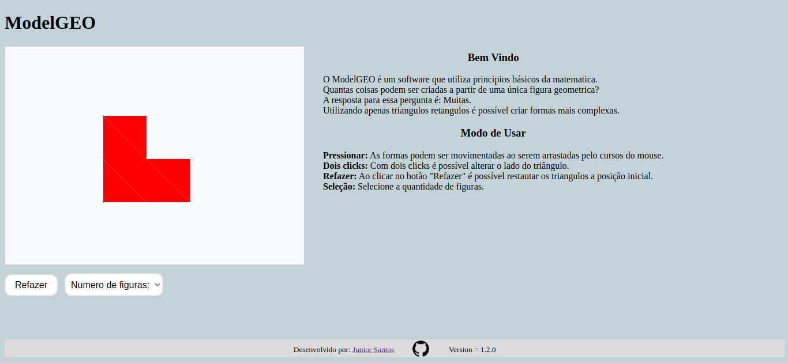

# ModelGEO

A matemática pode ser muito interessante.

A partir de figuras geometricas básicas, é possível construir figuras um pouco mais complicadas.



Esse software também é utilizado no software "[Determinantes e Areas](https://github.com/MS901b/determinantes_areas)" do [Matemática Multimídia](https://m3.ime.unicamp.br/).

## Execução

Para executar o programa, basta seguir o passo:

### 1 - Clonar o repositório

Clone o repositório para a sua máquina local.

Você pode realizar essa operação exeutando os comandos a baixo em um Terminal Linux:

```bash
git clone https://github.com/jr-santos98/ModelGEO.git
cd ModelGEO/
```

### 2 - Execute o arquivo index.html

Abra o arquivo 'index.html' no navegador de sua preferência.

### 3 - Divirta-se

Siga as instruções e divirta-se! :wink:
